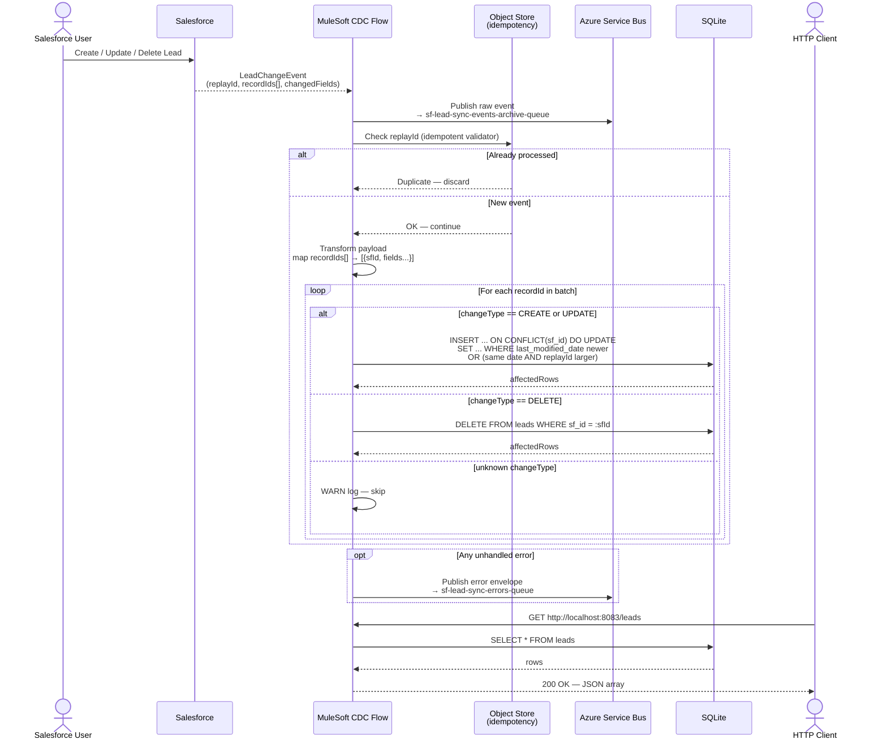

# Salesforce CDC → SQLite + Azure Service Bus (MuleSoft 4 POC)

A proof-of-concept MuleSoft 4 application that subscribes to **Salesforce Change Data Capture (CDC)** events on the `Lead` and `Opportunity` objects and synchronises them in real time to a **SQLite** database, while archiving every raw event to **Azure Service Bus**.

---

## Table of Contents

- [Architecture Overview](#architecture-overview)
- [Sequence Diagram](#sequence-diagram)
- [Key Design Decisions](#key-design-decisions)
- [Prerequisites](#prerequisites)
- [Project Structure](#project-structure)
- [Setup](#setup)
- [Running the Application](#running-the-application)
- [Testing the Integration](#testing-the-integration)
- [API Reference](#api-reference)
- [Database Schema](#database-schema)
- [Connector Versions](#connector-versions)
- [Known Issues & Workarounds](#known-issues--workarounds)

---

## Architecture Overview

```
Salesforce (LeadChangeEvent)          Salesforce (OpportunityChangeEvent)
        │  /data/LeadChangeEvent               │  /data/OpportunityChangeEvent
        ▼                                       ▼
┌──────────────────────────────────────────────────────────────┐
│                   MuleSoft 4 Application                     │
│                                                              │
│  ── Lead Flow ──────────────────────────────────────────     │
│  1. Archive raw event  ──────────────► Azure Service Bus     │
│                                        (sf-lead-sync-events-archive-queue) │
│  2. Idempotency check (replayId)                             │
│     via Persistent Object Store (leads)                      │
│  3. Transform + foreach recordIds                            │
│     ┌─ CREATE / UPDATE ──► SQLite upsert → leads table       │
│     ├─ DELETE          ──► SQLite delete                     │
│     └─ unknown         ──► WARN log                          │
│  On error ───────────────────────────► sf-lead-sync-errors-queue │
│                                                              │
│  ── Opportunity Flow ───────────────────────────────────     │
│  1. Archive raw event  ──────────────► Azure Service Bus     │
│                                        (sf-opportunity-sync-events-archive-queue) │
│  2. Idempotency check (replayId)                             │
│     via Persistent Object Store (opportunities)              │
│  3. Transform + foreach recordIds                            │
│     ┌─ CREATE / UPDATE ──► SQLite upsert → opportunities table │
│     ├─ DELETE          ──► SQLite delete                     │
│     └─ unknown         ──► WARN log                          │
│  On error ───────────────────────────► sf-opportunity-sync-errors-queue │
│                                                              │
│  GET /leads         ────────────────► SQLite SELECT (leads)  │
│  GET /opportunities ────────────────► SQLite SELECT (opps)   │
└──────────────────────────────────────────────────────────────┘
```

---

## Sequence Diagram



---

## Key Design Decisions

### 1. Batch recordIds expansion
Salesforce may include **multiple recordIds** in a single CDC event (e.g., a bulk status update). The flow expands `ChangeEventHeader.recordIds[]` into an array via DataWeave `map` and iterates with `foreach`, so every record in the batch is persisted individually.

### 2. Idempotency via replayId
The `replayId` of each event is stored in a **persistent Object Store**. If the same event is delivered more than once (e.g., after a reconnect), the `idempotent-message-validator` discards the duplicate before any processing occurs.

### 3. Ordering guard (race-condition safety)
With `maxConcurrency > 1`, two events for the same Lead can race. The SQLite upsert only executes when the incoming event is provably newer:

```sql
ON CONFLICT(sf_id) DO UPDATE SET ...
WHERE excluded.last_modified_date > leads.last_modified_date
   OR (excluded.last_modified_date = leads.last_modified_date
       AND CAST(excluded.replay_id AS INTEGER) > CAST(leads.replay_id AS INTEGER))
   OR leads.last_modified_date IS NULL
```

`last_modified_date` (ISO 8601 from Salesforce) is the primary sort key; `replayId` is the tiebreaker for events with identical timestamps.

### 4. COALESCE on partial updates
CDC `UPDATE` events only include **changed fields**; unchanged fields are not sent. `COALESCE(excluded.field, field)` preserves the existing value instead of overwriting with `null`.

### 5. Archive-first
The raw event is published to Azure Service Bus **before** any processing. This ensures every event is preserved even if downstream processing fails, enabling reprocessing from the archive.

### 6. Structured error envelope
Errors are caught by `on-error-continue` and published to a dedicated error queue with a structured JSON envelope including:
- `retryable` flag (based on error type — connectivity errors are retryable)
- original payload
- flow name, host, timestamps

---

## Prerequisites

| Requirement | Version |
|---|---|
| Java | 17 |
| Maven | 3.8+ |
| Anypoint Studio | 7.x (optional, for visual editing) |
| MuleSoft EE Runtime | 4.9.0+ |
| Salesforce org | Developer Edition or Sandbox with CDC enabled |
| Azure Service Bus | Standard or Premium tier |
| SQLite | bundled via JDBC (no install needed) |

### Salesforce Setup
1. Enable CDC for both objects:
   **Setup → Integrations → Change Data Capture → Select Lead and Opportunity**
2. Create a connected user with **Streaming API** permission.

### Azure Service Bus Setup
Create four queues:
- `sf-lead-sync-events-archive-queue` — raw Lead event archive
- `sf-lead-sync-errors-queue` — Lead error dead-letter
- `sf-opportunity-sync-events-archive-queue` — raw Opportunity event archive
- `sf-opportunity-sync-errors-queue` — Opportunity error dead-letter

Create an App Registration with **Azure Service Bus Data Sender** role on all four queues.

---

## Project Structure

```
salesforce-cdc-opportunity-lead-poc/
├── src/
│   ├── main/
│   │   ├── mule/
│   │   │   └── salesforce-cdc-flow.xml     # All flows (leads + opportunities)
│   │   └── resources/
│   │       ├── config.properties.example   # Config template (copy → config.properties)
│   │       ├── leads.db                    # SQLite database (leads + opportunities tables)
│   │       ├── migrations/
│   │       │   ├── V1__create_leads_table.sql        # Lead schema
│   │       │   └── V2__create_opportunities_table.sql # Opportunity schema
│   │       └── log4j2.xml                  # Logging config
│   └── test/
│       └── resources/
│           └── sample_data/
│               ├── json.json               # Sample LeadChangeEvent payload
│               └── opportunity.json        # Sample OpportunityChangeEvent payload
├── mule-artifact.json                      # Mule app descriptor
└── pom.xml                                 # Dependencies + Netty conflict fix
```

---

## Setup

### 1. Clone the repository

```bash
git clone https://github.com/Jefferson1919/salesforce-cdc-poc.git
cd salesforce-cdc-poc
```

### 2. Configure credentials

Copy the example file and fill in your values:

```bash
cp src/main/resources/config.properties.example src/main/resources/config.properties
```

Edit `src/main/resources/config.properties`:

```properties
SF_USERNAME=your-salesforce-username@example.com
SF_PASSWORD=your-salesforce-password
SF_SECURITY_TOKEN=your-salesforce-security-token
SF_AUTHORIZATION_URL=https://your-org.my.salesforce.com/services/Soap/u/64.0

DB_PATH=C:/absolute/path/to/src/main/resources/leads.db

AZURE_NAMESPACE=your-service-bus-namespace
AZURE_TENANT_ID=your-tenant-id
AZURE_CLIENT_ID=your-client-id
AZURE_CLIENT_SECRET=your-client-secret

MAX_CONCURRENCY=5
OPPORTUNITY_EVENTS_ARCHIVE_QUEUE=sf-opportunity-sync-events-archive-queue
OPPORTUNITY_ERRORS_QUEUE=sf-opportunity-sync-errors-queue
```

> **Note:** `DB_PATH` must be an **absolute path** with forward slashes on Windows
> (e.g. `C:/Users/you/salesforce-cdc-opportunity-lead-poc/src/main/resources/leads.db`).

### 3. Apply the database migration

The `leads` table already exists in `leads.db`. Apply the Opportunity migration before starting the app:

```bash
sqlite3 src/main/resources/leads.db < src/main/resources/migrations/V2__create_opportunities_table.sql
```

Verify both tables exist:
```bash
sqlite3 src/main/resources/leads.db ".tables"
# Expected: leads  opportunities
```

---

## Running the Application

### Option A — Maven

```bash
mvn mule:run
```

`config.properties` is loaded automatically by the Mule runtime via `<configuration-properties file="config.properties" />`.

On startup you should see both CDC subscriptions in the logs:
```
INFO  CDC Flow subscribed to /data/LeadChangeEvent
INFO  CDC Flow subscribed to /data/OpportunityChangeEvent
```

### Option B — Anypoint Studio

Import the project as a Maven project, set the properties in **Run Configurations → Arguments**, and run.

---

## Testing the Integration

### End-to-end test

1. **Start** the application — you should see:
   ```
   INFO  CDC Flow subscribed to /data/LeadChangeEvent
   ```

2. **Create a Lead** in Salesforce (UI or API):
   ```
   First Name: John
   Last Name:  Doe
   Company:    Acme Corp
   Email:      john.doe@acme.com
   ```

3. **Watch the logs** — within ~2 seconds you should see:
   ```
   INFO  CDC event received - changeType: CREATE
   INFO  Lead upserted - sfId: 00Qxx000000xxxxx changeType: CREATE affected rows: 1
   ```

4. **Query the database**:
   ```bash
   curl http://localhost:8083/leads
   ```
   Or open `src/main/resources/leads.db` in [DB Browser for SQLite](https://sqlitebrowser.org/).

### Bulk update test (batch recordIds)

1. Select multiple Leads in Salesforce and change their Status in one operation.
2. Salesforce sends **one CDC event** with all recordIds in the batch.
3. Verify all leads are updated in SQLite:
   ```bash
   curl http://localhost:8083/leads | jq '.[].status'
   ```

### Race condition / ordering test

1. Stop the application.
2. Make two quick changes to the same Lead (e.g., Status → `Closed`, then Status → `Open`).
3. Restart — both buffered events are replayed concurrently.
4. Verify the final status in SQLite is `Open` (the most recent change wins via the ordering guard).

### Delete test

1. Delete a Lead in Salesforce.
2. Verify it is removed from SQLite:
   ```bash
   curl http://localhost:8083/leads   # lead should not appear
   ```

### Opportunity end-to-end test

1. **Start** the application.

2. **Create an Opportunity** in Salesforce (UI or API):
   ```
   Name:      Enterprise Renewal FY26
   Stage:     Prospecting
   Close Date: 2026-06-30
   Amount:    50000
   ```

3. **Watch the logs**:
   ```
   INFO  CDC event received - changeType: CREATE
   INFO  Opportunity upserted - sfId: 006xx000000xxxxx changeType: CREATE affected rows: 1
   ```

4. **Query the database**:
   ```bash
   curl http://localhost:8083/opportunities
   ```

5. **Update** the Opportunity (e.g., change Stage to `Proposal/Price Quote`):
   - Only `stage_name` and `last_modified_date` change in SQLite; all other fields are preserved via `COALESCE`.

6. **Delete** the Opportunity and verify it disappears:
   ```bash
   curl http://localhost:8083/opportunities   # should not appear
   ```

---

## API Reference

### `GET /leads`

Returns all synced leads from SQLite.

**Request**
```
GET http://localhost:8083/leads
```

**Response** — `200 OK`
```json
[
  {
    "id": 1,
    "sf_id": "00QgL00000BiO6jUAF",
    "first_name": "John",
    "last_name": "Doe",
    "email": "john.doe@acme.com",
    "phone": "+5511999990000",
    "company": "Acme Corp",
    "status": "Open - Not Contacted",
    "lead_source": null,
    "change_type": "CREATE",
    "change_origin": "com/salesforce/api/soap/66.0;client=SfdcInternalAPI/",
    "replay_id": "845900",
    "created_date": "2026-03-18T21:00:00.000Z",
    "last_modified_date": "2026-03-18T21:00:00.000Z",
    "synced_at": "2026-03-18 21:00:01"
  }
]
```

---

### `GET /opportunities`

Returns all synced opportunities from SQLite.

**Request**
```
GET http://localhost:8083/opportunities
```

**Response** — `200 OK`
```json
[
  {
    "id": 1,
    "sf_id": "006gL00000XYZAbQAL",
    "opportunity_name": "Enterprise Renewal FY26",
    "amount": 125000.0,
    "stage_name": "Proposal/Price Quote",
    "close_date": "2026-04-30",
    "probability": 70.0,
    "account_id": "001gL00001ABCDeQAL",
    "owner_id": "005gL00000BNrrhQAD",
    "type": "Existing Customer - Upgrade",
    "lead_source": "Partner Referral",
    "currency_iso_code": "USD",
    "description": "Strategic renewal for enterprise tier.",
    "change_type": "UPDATE",
    "change_origin": "com/salesforce/api/soap/66.0;client=SfdcInternalAPI/",
    "replay_id": "950001",
    "created_date": "2026-03-19T11:10:00.000Z",
    "last_modified_date": "2026-03-19T11:15:00.000Z",
    "synced_at": "2026-03-19 11:15:02"
  }
]
```

---

## Database Schema

### `leads` table

| Column | Type | Notes |
|---|---|---|
| id | INTEGER | Auto-increment PK |
| sf_id | TEXT UNIQUE | Salesforce Lead ID |
| first_name | TEXT | |
| last_name | TEXT | |
| email | TEXT | |
| phone | TEXT | |
| company | TEXT | |
| status | TEXT | |
| lead_source | TEXT | |
| change_type | TEXT | CREATE / UPDATE / DELETE |
| change_origin | TEXT | CDC metadata |
| replay_id | TEXT | CDC event ID (idempotency) |
| created_date | TEXT | ISO 8601 |
| last_modified_date | TEXT | ISO 8601 — ordering guard key |
| synced_at | TEXT | Auto timestamp on insert/update |

### `opportunities` table

| Column | Type | Notes |
|---|---|---|
| id | INTEGER | Auto-increment PK |
| sf_id | TEXT UNIQUE | Salesforce Opportunity ID |
| opportunity_name | TEXT | Opportunity.Name |
| amount | REAL | |
| stage_name | TEXT | |
| close_date | TEXT | |
| probability | REAL | |
| account_id | TEXT | Related Account ID |
| owner_id | TEXT | |
| type | TEXT | |
| lead_source | TEXT | |
| currency_iso_code | TEXT | |
| description | TEXT | |
| change_type | TEXT | CREATE / UPDATE / DELETE |
| change_origin | TEXT | CDC metadata |
| replay_id | TEXT | CDC event ID (idempotency) |
| created_date | TEXT | ISO 8601 |
| last_modified_date | TEXT | ISO 8601 — ordering guard key |
| synced_at | TEXT | Auto timestamp on insert/update |

> Migration scripts are in `src/main/resources/migrations/`.

---

## Connector Versions

| Connector | Version |
|---|---|
| mule-salesforce-connector | 11.3.3 |
| mule4-salesforce-pubsub-connector | 1.2.0 |
| mule-azure-service-bus-connector | 3.6.0 |
| mule-http-connector | 1.11.1 |
| mule-db-connector | 1.15.0 |
| mule-objectstore-connector | 1.2.5 |
| sqlite-jdbc | 3.51.3.0 |

---

## Known Issues & Workarounds

### Netty classloader conflict (`NoClassDefFoundError: DefaultPromise$1`)

**Symptom:** `reactor-http-nio` threads stop with a `NoClassDefFoundError` after startup.

**Root cause:** `mule-http-connector` (Reactor Netty) and `mule-azure-service-bus-connector` (azure-core-http-netty) bundle different Netty versions (`4.1.130.Final` vs `4.1.127.Final`) in separate plugin classloaders. Cross-plugin callbacks fail when the wrong classloader is active.

**Fix applied:** `additionalPluginDependencies` in `pom.xml` forces the Azure connector's classloader to load Netty `4.1.130.Final`, aligning both connectors to the same version:

```xml
<additionalPluginDependencies>
  <plugin>
    <groupId>com.mulesoft.connectors</groupId>
    <artifactId>mule-azure-service-bus-connector</artifactId>
    <additionalDependencies>
      <dependency>
        <groupId>io.netty</groupId>
        <artifactId>netty-common</artifactId>
        <version>4.1.130.Final</version>
      </dependency>
      <!-- ... other netty artifacts -->
    </additionalDependencies>
  </plugin>
</additionalPluginDependencies>
```

> **Note:** `exportedPackages` in `mule-artifact.json` does **not** solve plugin-to-plugin classloader conflicts — it only exports application packages to connectors.

---

## License

MIT
